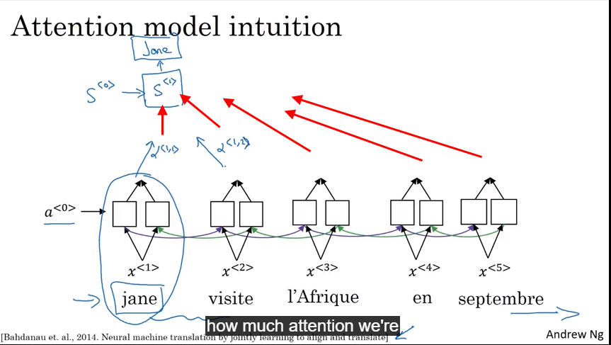
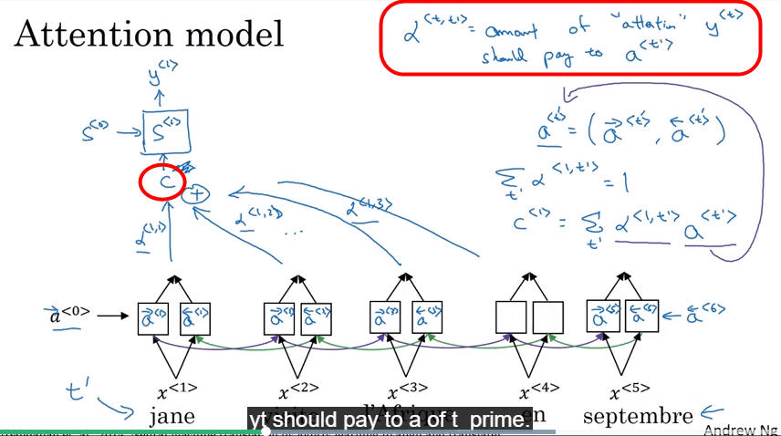
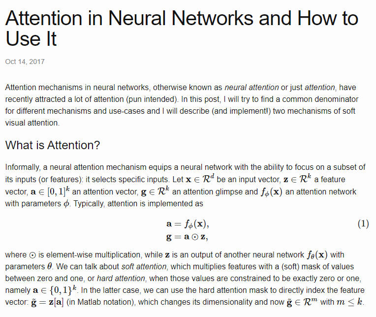

# Attention model
---------
## Neural Machine Translation in Linear Time

- https://arxiv.org/pdf/1610.10099.pdf    
> The ByteNet is a one-dimensional convolutional neural network that is composed of two parts, one to encode the source sequence and the other to decode the target sequence.

## Attention Is All You Need

- https://arxiv.org/pdf/1706.03762.pdf
    
> An attention function can be described as mapping a query and a set of key-value pairs to an output, where the query, keys, values, and output are all vectors. The output is computed as a weighted sum of the values, where the weight assigned to each value is computed by a compatibility function of the query with the corresponding key

 

BLEU score
> Bi-ligual evaluation understudy
> Evaluate how good a machine generated sentence

- Greedy search
- Beam search
- Improve beam search

> Human will not read all then translate, human will do part by part...so every time we generate a y, we use attention to decision how to attend the x...

$\alpha$ are the amount of attension yt 
should pay attention to a $k_{n+1}$

$$I = \int \rho R^{2} dV$$

~~~
import pandas as pd
pd.read_csv
~~~

- The definition here, have a function
- Soft/hard attention
