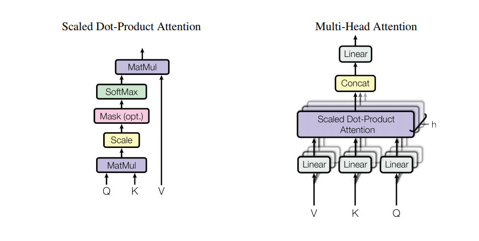

# Attention model

## Neural Machine Translation in Linear Time

    - https://arxiv.org/pdf/1610.10099.pdf    
    > The ByteNet is a one-dimensional convolutional neural network that is composed of two parts, one to encode the source sequence and the other to decode the target sequence.

## Attention Is All You Need
    - https://arxiv.org/pdf/1706.03762.pdf
    > An attention function can be described as mapping a query and a set of key-value pairs to an output,
    where the query, keys, values, and output are all vectors. The output is computed as a weighted sum
    of the values, where the weight assigned to each value is computed by a compatibility function of the query with the corresponding key

     
    