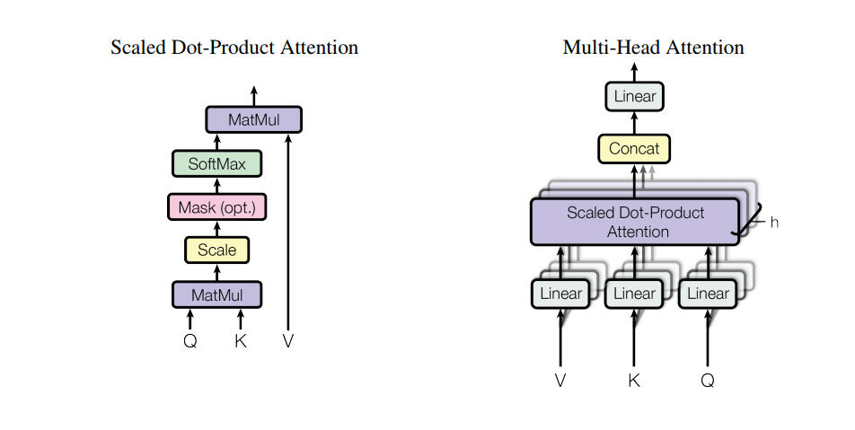

# Introduction

Summarize reading notes here

Reinforcement
- https://drive.google.com/file/d/1xeUDVGWGUUv1-ccUMAZHJLej2C7aAFWY/view

- Markov Decision Process

    Reinforcement Learning 第四次讀書會 Part 1

    https://www.youtube.com/watch?v=_-d8XX8R_OA&index=7&list=PL-myaKI4DslXV1F1Pzyk5BUO7oEpghl9G

    Discount 
    
    Bellman Equation

        Calculate all expected reward in the future

    Markov Reward Process + action -> Markov Decision Process

    State-value function

    action-value function

- Dynamic programing

    We do have full knowledge about env

    break down problem to sub-prob

    iterative policy evaluation

- Monte carlo methods

    We dont have full knowledge about environment

    Reinforcement Learning 第六次讀書會 Part 1

    https://www.youtube.com/watch?v=l5Fnd2JZYwU&index=11&list=PL-myaKI4DslXV1F1Pzyk5BUO7oEpghl9G

- Temporal-Difference Learning

    走一步學一步

    Reinforcement Learning 第七次讀書會 Part 1

    SARSA (on-policy)

    Q-Learning (off-policy)

    https://www.youtube.com/watch?v=xG_JYzo3Pr8&list=PL-myaKI4DslXV1F1Pzyk5BUO7oEpghl9G&index=13

- Multistep bootstraping

    1 step TD
    multi-step...
    infinity step => MonteCarlo

    https://www.youtube.com/watch?v=PR6xD1kemH0&index=15&list=PL-myaKI4DslXV1F1Pzyk5BUO7oEpghl9G

Attention model

## Neural Machine Translation in Linear Time

## Attention Is All You Need
    - https://arxiv.org/pdf/1706.03762.pdf
    - An attention function can be described as mapping a query and a set of key-value pairs to an output,
        where the query, keys, values, and output are all vectors. The output is computed as a weighted sum
        of the values, where the weight assigned to each value is computed by a compatibility function of the
        query with the corresponding key
         
